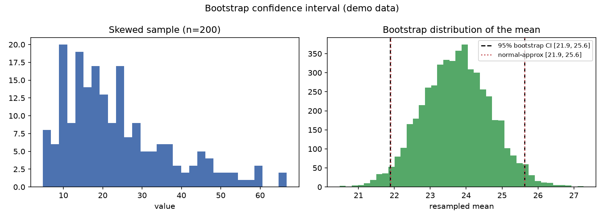

# Bootstrap Confidence Intervals

You have one sample and a single estimate — a mean, a median, a ratio. How sure are you of it? The bootstrap answers that without any formula for the standard error: it just resamples your data and watches how much the estimate wobbles.

## Why This Matters

Classic confidence intervals assume your statistic is normally distributed, which fails for skewed data, medians, ratios, and small samples. The bootstrap makes no such assumption. By resampling the data with replacement thousands of times and recomputing the statistic, it builds the sampling distribution empirically — and the middle 95% of that distribution is your confidence interval.

## How It Works

1. Resample the data with replacement, same size, thousands of times.
2. Compute the statistic on each resample.
3. Take the 2.5th and 97.5th percentiles as the 95% interval.

## What the Demo Shows



The demo draws a skewed (lognormal) sample and bootstraps the mean. The bootstrap interval (black) and the normal-approximation interval (red) diverge — because the data are skewed, and the bootstrap is the one you should trust.

## Run It

```bash
pip install -r requirements.txt
python demo.py
```

> Demonstrated on synthetic data, so it's fully reproducible with no external downloads.
